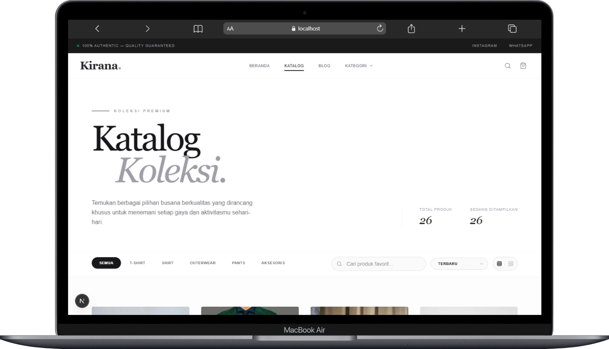

<p align="center">
  
</p>

# Kirana Katalog Client

Katalog Client adalah antarmuka web (frontend) untuk **Kirana Katalog**, sebuah aplikasi platform katalog pakaian premium. Proyek ini dirancang untuk memberikan pengalaman penelusuran produk yang elegan, responsif, dan cepat bagi pengguna. 
Proyek ini dikembangkan menggunakan tumpukan teknologi modern untuk memastikan skalabilitas dan performa antarmuka yang optimal.

## 🚀 Teknologi yang Digunakan
Proyek ini dibangun menggunakan beberapa teknologi utama berikut:
- **[Next.js](https://nextjs.org/)** - Framework React untuk *server-side rendering* dan pembuatan situs statis.
- **[React](https://reactjs.org/)** - Pustaka JavaScript untuk membangun antarmuka pengguna.
- **[TypeScript](https://www.typescriptlang.org/)** - Superset JavaScript yang menambahkan pengetikan statis (static typing).
- **[Tailwind CSS](https://tailwindcss.com/)** - Framework CSS *utility-first* untuk penataan gaya (styling) yang cepat dan responsif.
- **[PNPM](https://pnpm.io/)** - Manajer paket (package manager) yang cepat dan efisien.

## 📋 Prasyarat Sistem
Sebelum Anda memulai proses instalasi, pastikan sistem Anda telah memasang perangkat lunak berikut:
1. **Node.js** (versi 18.x atau lebih baru disarankan).
2. **PNPM** (dapat diinstal melalui npm dengan perintah `npm install -g pnpm`).
3. **Git** untuk melakukan kloning repositori.

## 🛠️ Panduan Instalasi dan Penggunaan
Ikuti langkah-langkah di bawah ini untuk menjalankan proyek secara lokal di mesin Anda:

1. **Kloning Repositori**
   Unduh salinan repositori ke mesin lokal Anda menggunakan Git:
   ```bash
   git clone https://github.com/riskyyiman/katalog-client.git
   ```
2. **Masuk ke Direktori Proyek**
Arahkan terminal Anda ke dalam folder proyek yang baru saja diunduh:
```Bash
cd katalog-client
````

3. **Instalasi Dependensi**
Unduh dan pasang semua paket yang dibutuhkan oleh aplikasi menggunakan manajer paket PNPM:
```Bash
pnpm install
```

4. **Menjalankan Server Pengembangan**
Setelah proses instalasi selesai, jalankan server pengembangan lokal dengan perintah berikut:
```Bash
pnpm dev
```
5. **Akses Aplikasi**
Buka peramban (browser) web dan akses alamat berikut untuk melihat aplikasi yang sedang berjalan:
http://localhost:3000

🤝 Kontribusi
by risky with love
